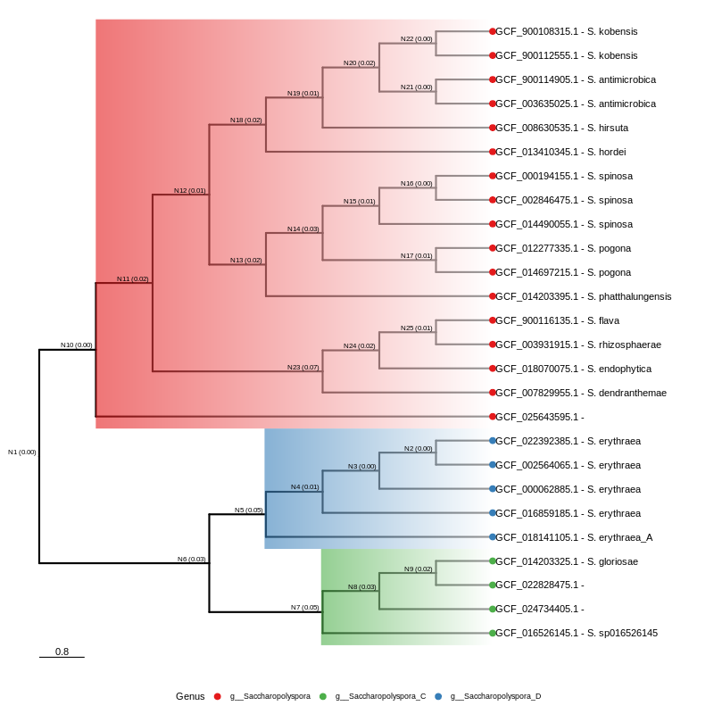

# autoMLST Wrapper
Summary of [autoMLST Wrapper](https://github.com/KatSteinke/automlst-simplified-wrapper) results from project: `[{{ project().name }}]`

## Description
This report provides an overview of the result from [autoMLST Wrapper](https://github.com/KatSteinke/automlst-simplified-wrapper), a modified version of [autoMLST](https://bitbucket.org/ziemertlab/automlst) tailored for simplified usability. By integrating a straightforward wrapper script, this fork eliminates the need for additional organism selection steps, streamlining the process for users.

## Visualization
The tree visualization represents the phylogenetic relationships between various strains of the genus. This visualization aids in understanding the genetic diversity and evolutionary history of these genomes.

    

    

<table id="itables_14422be4_f3dd_463f_959e_ed50ba51ee0c" class="display compact" data-quarto-disable-processing="true" style="table-layout:auto;width:auto;margin:auto;caption-side:bottom">
<thead>
    <tr style="text-align: right;">

      <th>genome_id</th>
      <th>genus_original</th>
      <th>species_original</th>
      <th>strain</th>
      <th>phylum</th>
      <th>class</th>
      <th>order</th>
      <th>family</th>
      <th>genus</th>
      <th>species</th>
    </tr>
  </thead><tbody><tr><td>Loading... (need <a href=https://mwouts.github.io/itables/troubleshooting.html>help</a>?)</td></tr></tbody>

</table>
<link rel="stylesheet" type="text/css" href="https://cdn.datatables.net/1.13.1/css/jquery.dataTables.min.css">

[Download Table](assets/tables/automlst_tree_table.csv){:target="_blank" .md-button}

## Interactive Visualization with iTOL
For an enhanced, interactive visualization experience, users are encouraged to download the tree file and the corresponding annotation table. These files can be uploaded to [iTOL (Interactive Tree Of Life)](https://itol.embl.de/), a web-based tool for the display, manipulation, and annotation of phylogenetic trees. Please check the [iTOL help page](https://itol.embl.de/help.cgi) for the upload guide and annotation format.

<a href="../assets/iTOL_annotation/automlst_tree_with_ids.newick" download class="md-button">Download iTOL Tree</a> <a href="../assets/iTOL_annotation/iTOL_tree_label.txt" download class="md-button">Download iTOL Label</a> <a href="../assets/iTOL_annotation/iTOL_tree_color.txt" download class="md-button">Download iTOL Color</a>

<a href="../assets/iTOL_annotation/iTOL_antismash_7.0.0_completeness.txt" download class="md-button">Download antiSMASH barchart</a> <a href="../assets/iTOL_annotation/iTOL_BiG-SCAPE_presence_antismash_7.0.0.txt" download class="md-button">Download BiG-SCAPE GCF presence</a> <a href="../assets/iTOL_annotation/iTOL_BiG-SCAPE_class_antismash_7.0.0.txt" download class="md-button">Download BiG-SCAPE barchart</a>

## References

- Letunic I and Bork P (2021) Nucleic Acids Res doi: [10.1093/nar/gkab301](https://doi.org/10.1093/nar/gkab301) Interactive Tree Of Life (iTOL) v5: an online tool for phylogenetic tree display and annotation
- **G Yu**, DK Smith, H Zhu, Y Guan, TTY Lam\*. ggtree: an
    R package for visualization and annotation of phylogenetic trees
    with their covariates and other associated data. ***Methods in
    Ecology and Evolution***. 2017, 8(1):28-36. doi:
    [10.1111/2041-210X.12628](https://doi.org/10.1111/2041-210X.12628)


- *{{ i }}*


