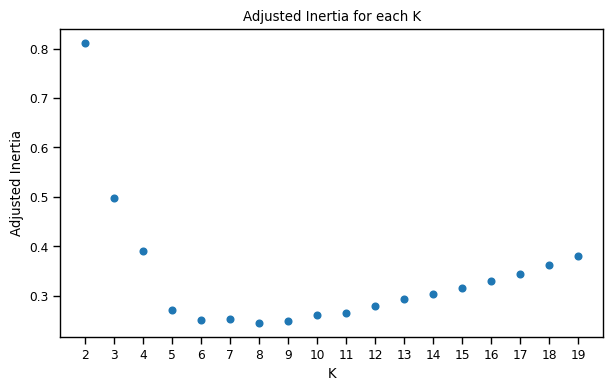
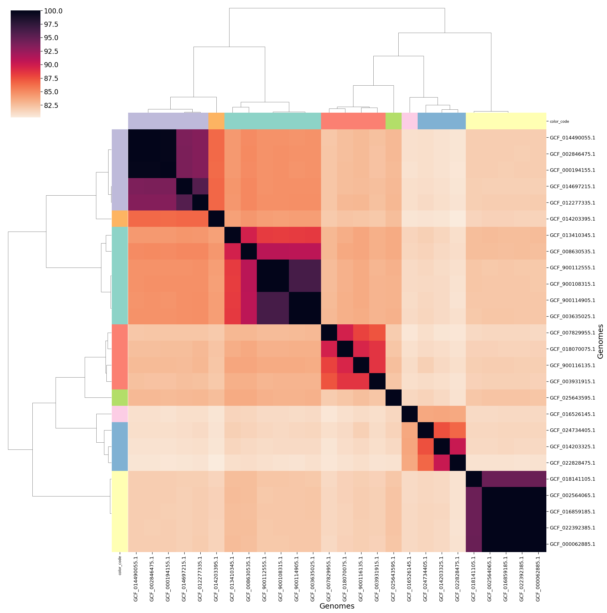

# FastANI
Summary of [FastANI](https://github.com/ParBLiSS/FastANI) results from project: `[{{ project().name }}]`

## Description
Fast Whole-Genome Similarity (ANI) Estimation

## Hierarchical Clustering based on ANI values

    

    

## Estimate Number of Clusters

    Estimated number of clusters: 7

    

    

## ANI Clustermap

    <Figure size 640x480 with 0 Axes>

    

    

## References

- Herman Saffar, O. 2022. An Approach for Choosing Number of Clusters for K-Means. [www.medium.com](https://medium.com/towards-data-science/an-approach-for-choosing-number-of-clusters-for-k-means-c28e614ecb2c)


- *{{ i }}*


